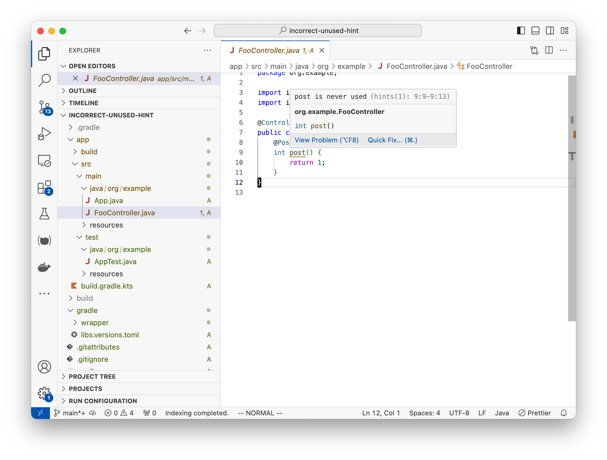

Steps to reproduce:

* Run `gradle build`. 
* Open the project in VSCode with the `Oracle.oracle-java` extension enabled and other Java extensions disabled.
* Open the file `app/src/main/java/org/example/FooController.java`.
* Note the squiggle under the `post` method and the warning (on hover) "post is never used":
  

This is despite the fact that `FooController#post` _is_ used in the generated file `app/build/generated/sources/annotationProcessor/java/main/org/example/FooController$Route.java`:

```java
      var result = controller.post();
```

Note that right-clicking on that invocation of `post` in `FooController$Route.java` and clicking Go To Definition works - it navigates back to `FooController.java`.